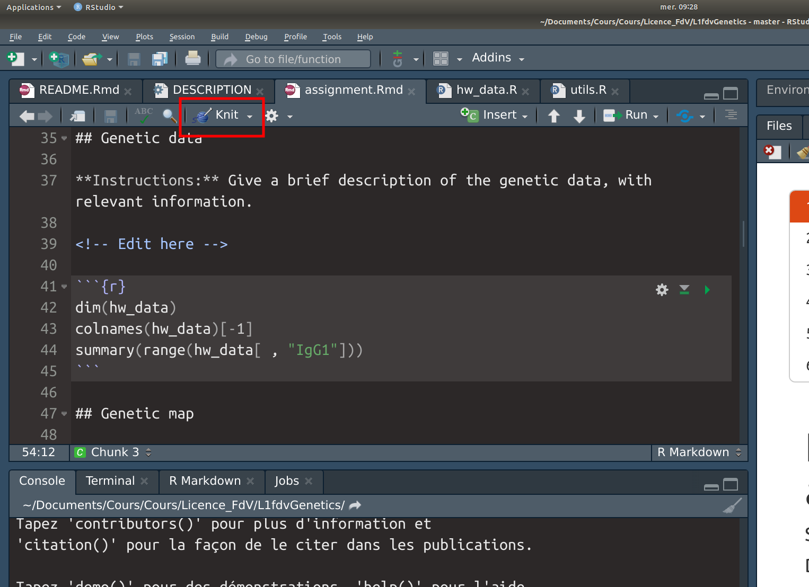
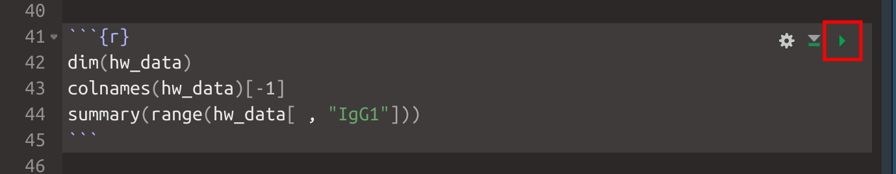

<!-- README.md is generated from README.Rmd. Please edit that file -->

```{r, include = FALSE}
knitr::opts_chunk$set(
  collapse = TRUE,
  comment = "#>",
  fig.path = "man/figures/README-",
  out.width = "100%"
)
```

# learningr

<!-- badges: start -->
[](https://mybinder.org/v2/gh/mahendra-mariadassou/learningr/master)
<!-- badges: end -->

The goal of learningr is to provide interactive tutorials for the statistics classes given by Tristan for UE 2.4. The tutorial are shamelessly taken from [rstudio-education](https://rstudio.cloud/learn/primers) for the basics of R and the tidyverse. Tutorials are packaged so you can install them on you computer and do the exercices without access to an internet connection. 

## Installation

### Installing R and other dependencies

You only need to perform each of the following steps **once**:

- installing **R** 
- installing **Rstudio**
- installing **R** packages `remotes` and `learnr`

However each of them may take some time. 

#### Installing R

Go to the CRAN [webpage](https://cran.r-project.org/), select your OS and follow the instructions. 

- On Windows, you should just download and execute an .exe file. 
- On MacOS, you should just download and execute a .pkg file. 
- On Linux, you can get install R from the command line using something like

```{bash, eval = FALSE}
## If you're on Ubuntu
sudo apt-get install r-base
```

#### Installing RStudio Desktop

Go to the [download](https://rstudio.com/products/rstudio/download/#download) page. Select, download and install the file corresponding to your OS. 

#### Installing R packages

Launch Rstudio (by clicking on the corresponding icon) and execute the following commands in the console

```{r eval = FALSE}
install.packages("remotes") 
install.packages("learnr") 
```

On **Windows**: you may need **Rtools** and **git** 

- **Rtools**: visit the dedicated [page](https://cran.r-project.org/bin/windows/Rtools/), download the suggested exe and install it on your computer
- **git**: visit the dedicated [page](https://git-scm.com/download/win), download the suggested exe and install it on your computer

On **MacOS**: you may need **XCode** 

- **XCode**: visit the dedicated [page](https://mac.r-project.org/tools/), download the **Mandatory tools** and install them on your computer

## Installing the tutorials

You need to install the tutorials **every time** there is an update (hopefully not too often)

### Installing the tutorials for the first time

You can install the tutorials from [GitHub](https://github.com/) by launching Rstudio and typing the following command in the console:

``` r
remotes::install_github("mahendra-mariadassou/learningr")
```

Alternatively, you can use a remote R session to complete the tutorial by launching binder:  [](https://mybinder.org/v2/gh/mahendra-mariadassou/learningr/master?urlpath=rstudio)

You only need a web browser, no account or anything and the tutorials will always be up to date. The main drawbacks of this solution (compared to the previous one) are that (i) you lose your progress each time you launch a new session and (ii) the binder image may take some time to launch (usually a few minutes). 

### Updating the tutorials

Whenever I fix a bug / typo or add new content, you need to update the tutorials on your computer. To do so, start a fresh Rstudio session and type the following command in the console:

``` r
remotes::install_github("mahendra-mariadassou/learningr")
```

## Starting a tutorial

This package is intended for use with `learnr`:

```{r example, eval = FALSE}
library(learnr)
```

You should only launch **one** tutorial at the time. Before launching a new tutorial, **restart R**. 

### Basics of programmings 

```{r programming, eval = FALSE}
## Launch only one tutorial at the time!!
learnr::run_tutorial("01_programming_basics", package = "learningr")
learnr::run_tutorial("03_visualisation_basics", package = "learningr")
```

### R and stats

```{r stats, eval = FALSE}
learnr::run_tutorial("02.1_random_variables", package = "learningr")
learnr::run_tutorial("02.2_classical_distributions", package = "learningr")
learnr::run_tutorial("02.3_bivariate_statistics", package = "learningr")
```

### Data visualization

```{r dataviz, eval = FALSE}
learnr::run_tutorial("04.1_exploratory_data_analysis", package = "learningr")
learnr::run_tutorial("04.2_barcharts", package = "learningr")
learnr::run_tutorial("04.3_histograms", package = "learningr")
learnr::run_tutorial("04.4_boxplots", package = "learningr")
learnr::run_tutorial("04.5_scatterplots", package = "learningr")
learnr::run_tutorial("04.6_linegraphs", package = "learningr")
```

## Data manipulation

```{r datamanipulation, eval = FALSE}
learnr::run_tutorial("05.1_tibbles", package = "learningr")
learnr::run_tutorial("05.2_isolating_data", package = "learningr")
learnr::run_tutorial("05.3_summaries", package = "learningr")
```

### Estimation and confidence intervals

```{r confint, eval = FALSE}
learnr::run_tutorial("06.1_sampling", package = "learningr")
learnr::run_tutorial("06.2_testing", package = "learningr")
```

## Tidy data

```{r tidy-data, eval = FALSE}
learnr::run_tutorial("07.1_reshape_data", package = "learningr")
learnr::run_tutorial("07.2_separate_columns", package = "learningr")
learnr::run_tutorial("07.3_join_datasets", package = "learningr")
```

## Troubleshooting

If you have an error when launching a vignette (it may happen on Windows with R 4.0.0), try this syntax (illustrated on the first vignette):

```{r programming_backup, eval = FALSE}
rmarkdown::run(file = NULL, 
               dir = learnr:::get_tutorial_path("01_programming_basics",  
                                                package = "learningr"), 
               shiny_args = list(launch.browser = 1))
```

## Homework 

Instructions for the homework are available on [Moodle](https://moodle.u-paris.fr/mod/assign/view.php?id=461131). 

The main file is a Rmd (similar to a jupyter notebook). You must write R code in **code chuncks**. 


You should **knit** the document to an html file once to get the raw results. You can do so by clicking on the knit button. 



You can also execute each chunck in the console (like in a Jupyter notebook) using the small green triangle (note that you should execute chuncks in turn as a chunck may depend on the result of previous chuncks). 



When you're done adding comments and editing the document (for example, hiding some output from the final reports), you should knit it to a html file and submit the Rmd (not the html) to moodle. 
